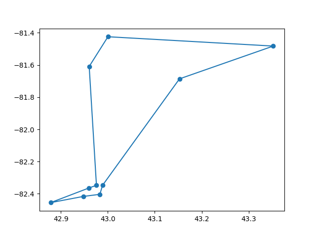
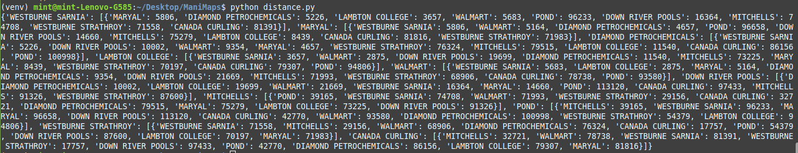

# ManiMaps

### Project Description:
ManiMaps is currently a working python application that uses the Google Maps API to extract data. Access to the app is gained 
through a CLI. It reads a standard text file where each line consists of an address, it builds an http request and sends it to 
google's servers. The app receives a json response which is then refined and structured.

***distance.py*** module extracts distances between addresses.

***geocode.py*** returns a list of the longitude/latitude coordinates for addresses given.

***durations.py*** module returns an asymmetric durations matrix.

***solver.py*** runs a two_opt tsp algorithm on a cartesian plane and retrives an optimal path.

### Output:
The screenshot below shows the output of running ***solver.py*** through a CLI.
The module runs a two_opt tsp algorithm and using pyplot spits out a window with
the longitude/latitude points connected by an optimal route.


### Output:
The screenshot below shows the output of running ***distance.py*** through a Command Line Interface.
5 different addresses are used, this produces 10 results. For every line the output shows two addresses 
and the distance between them in meters.


### How To Run The App:
> [!IMPORTANT]
> You will need a Google Maps API Key to run the app!
1. Create a local git repository.
    - Open up your terminal or command line interface.
    - Change into the directory where you want to clone the app.
    - Create a Folder named 'code' or whatever you want to call it.
    - Change into your 'code' directory.
    - Make sure git is installed.
    - In terminal run command:
```
$ git init .
```
2. Clone the repository.
    - In terminal run command:
```
$ git clone https://github.com/dwitka/ManiMaps.git
```
3. Confirm that there is a new folder named ManiMaps in your current directory.
    - Run the command:
    - ```$ ls```
4. Change into the ManiMaps folder.
    - Run the command:
    - ```$ cd ManiMaps```
5. Create a virtual environment.
    - Run the command:
    - ```$ python -m venv venv```
6. Get your virtual environment running.
    - ```$ source venv/bin/activate```
7. Install your dependencies.
    - ```$ pip install requirements.txt```
7. Add your API_Key to the code:
    - Open the file geocode.py with a text editor.
    - Above the data line:
    - ```ADDRESSES = []```
    - Add the line:
    - ```API_KEY = 'my api key'```
    - Make sure your api key is in quotes.
    - Save the file.
6. Run the app.
    - In terminal run command:
```
$ python solver.py
```
7. You should see the ouput:

